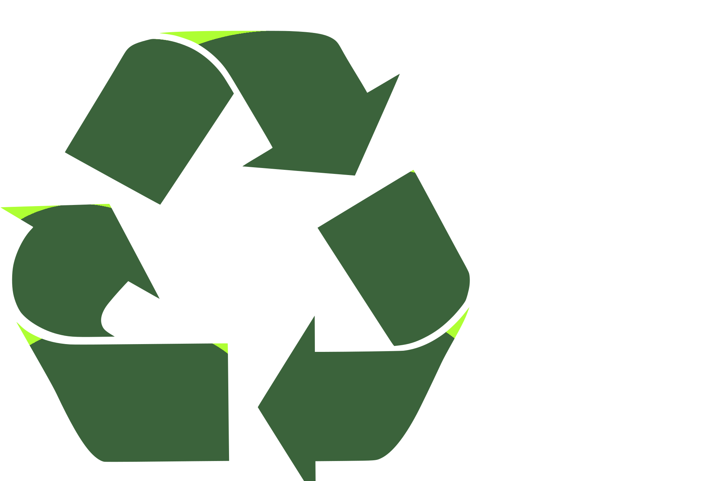
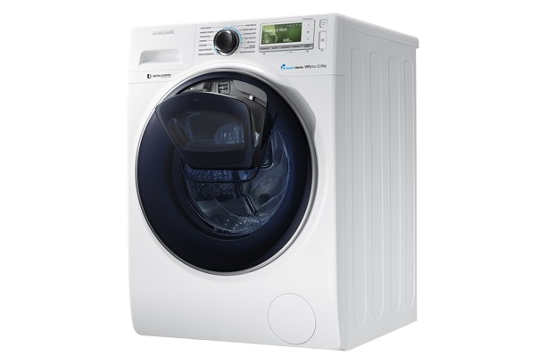
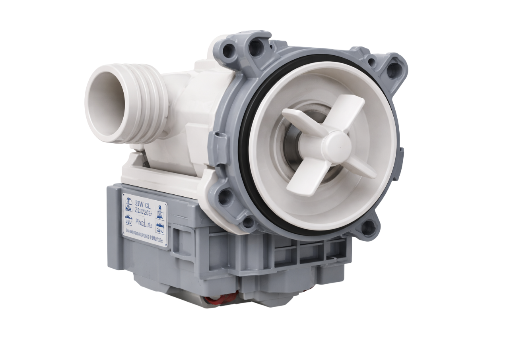

# dein-probleml-ser
Dein Problemlöser
<!DOCTYPE html>
<html lang="de">
<head>
  <meta charset="UTF-8" />
  <meta name="viewport" content="width=device-width, initial-scale=1.0" />
  <title>Dein Problemlöser</title>
  <link rel="stylesheet" href="index.css" />
  
</head>
<body>

  <!-- HEADER -->
  <header class="header">
    

      
Dein PROBLEMLÖSER.

 

      <nav class="navigation">
        <a class="a" href="#deals">Angebote</a>
        <a class="a" href="#cta">Mission</a>
        <a class="a" href="#service">Service</a>
      </nav>
    

  </header>

  <!-- HERO -->
  <section class="hero hero-first">
      

        

          <h1 class="heins">Kleine Entscheidung - große Wirkung - für unsere Umwelt </h1>
        
Waschmaschinen von Bosch, Siemens und vieles mehr.

        <a href="#" class="btn">Jetzt durchsuchen</a>
        

          <?xml version="1.0" standalone="no"?>
          <!DOCTYPE svg PUBLIC "-//W3C//DTD SVG 20010904//EN"
           "http://www.w3.org/TR/2001/REC-SVG-20010904/DTD/svg10.dtd">
          <svg version="1.0" xmlns="http://www.w3.org/2000/svg"
           viewBox="0 0 1574.000000 1580.000000"
           preserveAspectRatio="xMidYMid meet">
          <metadata>
          Created by potrace 1.15, written by Peter Selinger 2001-2017
          </metadata>
          <g transform="translate(0.000000,1280.000000) scale(0.100000,-0.100000)"
          fill="white" stroke="none" stroke-width="0.1">
          <path class="line line3" class="black" d="M7550 12785 c-231 -66 -361 -306 -290 -537 37 -122 133 -225 250
          -269 41 -16 94 -23 210 -30 213 -13 413 -35 581 -65 1241 -217 2322 -963 2977
          -2052 360 -599 575 -1316 608 -2022 3 -74 12 -162 20 -195 30 -120 110 -215
          234 -274 71 -34 81 -36 175 -36 93 0 105 3 172 34 121 57 212 169 243 300 15
          62 8 256 -16 485 -112 1082 -532 2059 -1237 2879 -169 197 -469 486 -677 653
          -789 632 -1738 1020 -2738 1119 -246 24 -447 28 -512 10z"/>
          <path class="line line2"  d="M7123 11229 c-106 -20 -212 -91 -271 -179 -128 -190 -80 -454 105
          -582 82 -56 133 -69 328 -84 484 -38 895 -152 1293 -359 297 -155 522 -318
          766 -555 591 -575 931 -1321 982 -2160 8 -139 31 -218 84 -292 153 -215 466
          -236 648 -45 103 109 127 201 112 424 -69 1019 -483 1936 -1196 2646 -708 706
          -1613 1115 -2629 1187 -157 11 -164 11 -222 -1z"/>
          <path   d="M2268 11129 c-209 -26 -414 -109 -633 -257 -585 -395 -1057 -1074
          -1371 -1969 -75 -215 -170 -551 -209 -738 -143 -696 -4 -1525 411 -2452 407
          -911 1145 -2008 1977 -2939 298 -334 1029 -940 1675 -1389 702 -488 1385 -857
          2017 -1090 146 -54 212 -75 410 -136 68 -20 279 -69 400 -93 243 -46 392 -60
          660 -60 308 -1 432 15 744 93 780 197 1418 494 1926 898 136 108 367 337 467
          463 158 199 289 425 337 585 50 162 70 394 52 590 -61 640 -404 1174 -991
          1540 -239 149 -683 352 -958 439 -449 141 -869 155 -1211 40 -283 -94 -494
          -261 -703 -554 -192 -271 -361 -431 -560 -531 -132 -67 -211 -84 -373 -83
          -122 1 -152 4 -230 28 -125 38 -280 114 -410 201 -522 350 -1753 1601 -2029
          2062 -64 107 -124 245 -153 349 -34 125 -38 309 -9 414 73 267 283 519 635
          760 478 327 678 867 565 1524 -59 345 -216 763 -438 1166 -249 453 -561 766
          -951 955 -179 86 -326 134 -525 171 -103 18 -415 27 -522 13z m470 -693 c364
          -79 662 -310 884 -685 196 -332 363 -750 414 -1036 25 -144 23 -354 -5 -460
          -46 -177 -138 -303 -302 -415 -713 -488 -1030 -1126 -894 -1796 44 -217 161
          -484 307 -704 317 -477 1294 -1491 1943 -2016 336 -271 649 -430 977 -496 157
          -31 416 -31 565 1 455 96 869 402 1202 889 114 166 239 261 406 308 91 25 328
          30 452 10 278 -47 609 -169 937 -348 227 -123 349 -212 487 -355 212 -220 321
          -465 344 -778 8 -109 -9 -279 -35 -345 -83 -210 -354 -524 -633 -734 -421
          -316 -938 -548 -1593 -716 -273 -70 -387 -83 -669 -77 -235 6 -324 16 -547 63
          -929 194 -2085 834 -3312 1833 -426 347 -621 530 -864 813 -1077 1257 -1812
          2533 -2042 3547 -58 257 -73 393 -74 656 -1 263 5 314 60 545 232 971 671
          1747 1209 2136 123 88 272 161 355 173 91 14 341 6 428 -13z"/>
          <path class="line line1" d="M6558 9611 c-121 -31 -218 -115 -275 -237 -26 -54 -28 -69 -28 -174
          0 -106 2 -120 28 -172 43 -88 116 -162 202 -204 67 -33 85 -37 226 -50 296
          -28 537 -93 774 -208 236 -114 389 -221 574 -401 185 -180 310 -348 420 -565
          141 -278 196 -482 240 -890 19 -172 102 -294 248 -363 119 -55 275 -48 389 19
          59 35 141 125 170 188 39 85 46 148 34 293 -84 1008 -643 1887 -1521 2391
          -364 210 -793 343 -1229 382 -149 13 -172 12 -252 -9z"/>
          </g>
          </svg>
          

        

      

      
        

    
      

        <svg class="svg-class"
   width="102.68478mm"
   height="120.96689mm"
   viewBox="0 0 230.68478 190.96689"
   version="1.1"
   id="svg1"
   xmlns="http://www.w3.org/2000/svg"
   xmlns:svg="http://www.w3.org/2000/svg">
  
  <defs
     id="defs1" />
  <g
     id="layer1"
     transform="translate(-3.2715839,-28.343923)"/>

     <radialGradient id="greenGradient" cx="50%" cy="35%" r="65%">
      <stop offset="0%" stop-color="#9AFF00"/>
      <stop offset="60%" stop-color="#2E8B57"/>
      <stop offset="100%" stop-color="#0B3D0B"/>
    </radialGradient>

  <path
  
     style="fill:url(#greenGradient);stroke:darkgreen;stroke-width:0.164583;stroke-opacity:0.945098"
     d="m 117.66926,155.90184 c 0,0 37.76414,-30.59373 46.84665,-64.055633 9.08251,-33.461889 9.08251,-32.505829 6.69238,-55.451131 -2.39014,-22.945299 -21.51122,-33.4618942 -21.51122,-33.4618942 0,0 -11.47265,-7.170407 -37.28611,1.434082 C 86.597502,12.971752 87.553556,40.69732 87.553556,40.69732 l 0.956053,141.01798 z"
     id="path22" />
     <image  href="bilder/servicetechnik.png" x="-40" y="40" opacity="0.9" width="400" height="400"/>
  <path
     style="fill:url(#greenGradient);stroke:darkgreen;opacity: 0.9;stroke-dasharray:none;stroke-opacity:0.66065;stroke-width:0.164583"
     d="m 55.015527,191.86139 c 0,0 -37.76414,-30.59372 -46.8466549,-64.05562 C -0.91363773,94.343867 -0.91363773,95.299927 1.4764923,72.354627 3.8666323,49.409329 22.987717,38.892734 22.987717,38.892734 c 0,0 11.47265,-7.170407 37.28611,1.434082 25.81345,8.604488 24.85739,36.330061 24.85739,36.330061 l -0.95605,141.017973 z"
     id="path22-4" />
</svg>
<h2 class="ideo">Co2 Emissionen eingesparrt</h2>
        
0

<!-- <h2>Co2 Emissionen eingesparrt</h2>
      
0
-->
      

      

      Fespreis 65 EUR ---
      Anfahrt 9 EUR ---
      *Es gibt Reparaturen die etwas mehr Aufwand benötigen. ---
      grunerplanet@proton.me
    

    </section>
    

<!--
<section id="deals">

  <h2 class="deals">DIE BESTEN DEALS</h2>
  <button class="bttn prev">&#10094;</button>
  

  

    

      
      
      

      <h3>BAUKNECHT</h3>
      <ul class="icon-list">
  <li>
    
    
    
      Erster Aufzählungspunkt mit Beschreibung
    
  </li>

  <li>
    

    
    
      Zweiter Aufzählungspunkt mit Beschreibung
    
  </li>

  <li>
    
     
    
    
      Dritter Aufzählungspunkt mit Beschreibung
    
  </li>
</ul>

    

    

      
      <h3>SIEMENS IQ700</h3>
      <ul class="icon-list">
  <li>
    
      
    
    
      Erster Aufzählungspunkt mit Beschreibung
    
  </li>

  <li>
    
     
    
    
      Zweiter Aufzählungspunkt mit Beschreibung
    
  </li>

  <li>
    

    
    
      Dritter Aufzählungspunkt mit Beschreibung
    
  </li>
</ul>

    

    

      
      <h3>Produkt 3</h3>
      <ul class="icon-list">
  <li>
    

    
    
      Erster Aufzählungspunkt mit Beschreibung
    
  </li>

  <li>
    
  
    
    
      Zweiter Aufzählungspunkt mit Beschreibung
    
  </li>

  <li>
    
  
    
    
      Dritter Aufzählungspunkt mit Beschreibung
    
  </li>
</ul>

    

    

      
      <h3>Produkt 3</h3>
      <ul class="icon-list">
  <li>
    

    
    
      Erster Aufzählungspunkt mit Beschreibung
    
  </li>

  <li>
    
  
    
    
      Zweiter Aufzählungspunkt mit Beschreibung
    
  </li>

  <li>
    
  
    
    
      Dritter Aufzählungspunkt mit Beschreibung
    
  </li>
</ul>

    

    

      
      <h3>BAUKNECHT</h3>
      <ul class="icon-list">
  <li>
    
    
    
      Erster Aufzählungspunkt mit Beschreibung
    
  </li>

  <li>
    

    
    
      Zweiter Aufzählungspunkt mit Beschreibung
    
  </li>

  <li>
    
     
    
    
      Dritter Aufzählungspunkt mit Beschreibung
    
  </li>
</ul>

    

    

      
      <h3>Produkt 3</h3>
      <ul class="icon-list">
  <li>
    

    
    
      Erster Aufzählungspunkt mit Beschreibung
    
  </li>

  <li>
    
  
    
    
      Zweiter Aufzählungspunkt mit Beschreibung
    
  </li>

  <li>
    
  
    
    
      Dritter Aufzählungspunkt mit Beschreibung
    
  </li>
</ul>

    

    

  

  <button class="bttn next">&#10095;</button>

</section> -->
     
    
  </section>

  <section id="cta" clas="cta">

         

      

        

        

      

      

      

<h3 class="txt-header">Neukauf Waschmaschine - Co2 Ausstoß von 1800 km Autofahrt.</h3>

so viel Emissionen eingesparrt.

0

        
 
        
      

    

 
  </section> 

  <section class="buchen">
    

</section>

  
  <section id="service" class="hero">
    

  
      

        

        <h1 class="uberschrift">Lange Wartzeiten? - POV: ich will heute waschen.</h1>

        
      

      

  
      

        <h1 class="uberschrift">REFURBISHED.</h1>
        <h1 class="uberschrift">REFURBISHED.</h1>
        <h1 class="uberschrift">REFURBISHED.</h1>
        <h1 class="uberschrift">REFURBISHED.</h1>
         
      

  
    

  

    

      

        
<h4 class="marke">Bosch. 
          Siemens. 
        Miele.
         
      BAUKNECHT  
        SAMSUNG.
         
      VIELE MEHR.</h4>
      
      

      
        

          

          

        

      

    

  </section>
  
  <section class="hero hero-sec">
    

      

      <video class="hero-video" autoplay muted loop playsinline>
        <source src="./e23.mp4" type="video/mp4">
      </video>
      <h6 class="last">POV: Du hast deine Waschmaschine entsorgt.</h6>
    

    

      <h5 class="last">Service - Rette deine Maschine.</h5>
      
      
    

  

  </section> 
  
  

  <footer class="footer">
    
© 2022-2025 Grüner Planet

  </footer>
 
</body>
</html>

